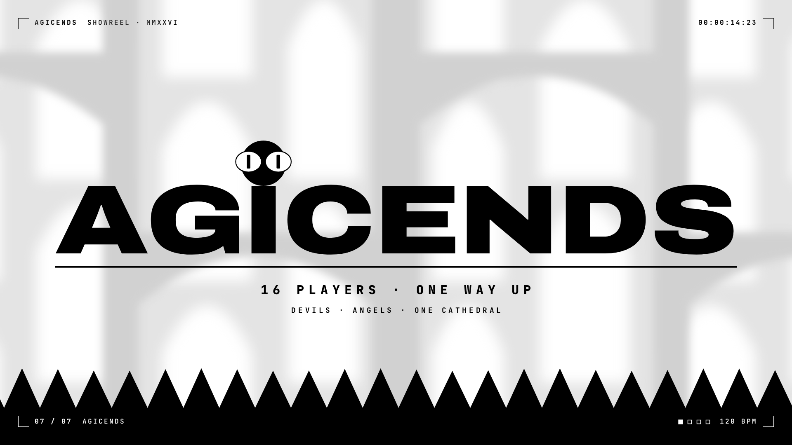

# AGICENDS — Showreel

[](https://claude.ai/artifact/LHR715HpyYG3qz171AchXc)

**[Watch the showreel](https://claude.ai/artifact/LHR715HpyYG3qz171AchXc)**: 15 s, 1920×1080, 60 fps, H.264 + AAC stereo. It is built to loop: it opens on two eyes blinking awake in the dark and ends on the same eyes closing.

The video isn't committed, to keep the repo light. `./build.sh` renders it into `out/`.

Everything is procedural. Every frame is a pure function of time, drawn on a canvas. The characters are the game's own parts from `client/character.js`, drawn as live vector paths. The soundtrack is synthesised sample by sample from the same timeline, so picture and sound cannot drift apart.

## Shot list (120 BPM, one bar = 2 s)

| # | Time | Shot | What happens |
|---|---|---|---|
| 01 | 0.0 | **Awaken** | Eyes open in a black void and dart left and right. On beat 2 they snap upward, and a log-space whip-zoom pulls out while the white cathedral bleeds in behind the body. |
| 02 | 2.0 | **Ascend** | Flap physics (impulse plus gravity arcs) with squash and stretch. The camera follows on a critically damped spring. Six coins land on eighth notes as a rising arpeggio, with parallax outline type behind. A snap-zoom dives into the seventh coin. |
| 03 | 4.0 | **Geometry** | The coin becomes a morphing polygon: 3→4→5→6→7→8→∞ sides on eighth notes, the game's coin, block, pentagon, hexagon, heptagon and octagon. It has an odometer numeral, a scrolling ticker, anchor handles, a dial and angle readouts. Two difference-blend circle wipes invert the frame, and the circle opens its eyes. |
| 04 | 6.0 | **Sixteen** | One becomes sixteen: the game's two rows of eight. A counter ticks on every landing, and each landing is a note on a rising ladder. Accessories spring in, then the row does a unison hop, look waves, a blink wave and a launch. |
| 05 | 8.0 | **Devil / Angel** | The onboarding question "WHO ARE YOU TODAY?" is typed, then slammed into a diagonal split screen: an inverted devil against an angel wearing the Second Wind halo. |
| 06 | 10.0 | **The Spikes** | The black floods back as the spike line. A deterministic 16-body physics chase runs with elastic (restitution 1.0) contacts. The four powerups are MULT, VACUUM, GHOST and SECOND WIND. A binary search times one stunned player's death to land exactly on beat 23. |
| 07 | 12.0 | **AGICENDS** | Logo letters rise out of the ground while their variable-font weight inflates from 250 to 900. The hero lands on the I and squashes it, becoming the dot the I never had. The spikes then swallow everything except the eyes, which close. |

## Techniques on show

Easing and damped springs · log-space camera zooms · parallax with depth-of-field blur · 180° motion blur (8–16 accumulated sub-frames per frame, never straddling a cut) · squash and stretch, anticipation and follow-through · secondary motion on ears and tails · polygon morphing through radial interpolation · echo trails · kinetic, variable-font and decode/scramble typography · masked reveals · difference-blend inversion wipes and impact frames · analytic particle systems · a pre-simulated rigid-body chase · match cuts (coin → triangle, octagon → circle → character, black panel → spike pit) · a HUD with a live timecode, chapter labels and a beat meter.

The palette follows the game exactly: pure black, pure white and the cathedral's two greys (`#d0d0d0`, `#b0b0b0`).

## Soundtrack

The track is in D minor at 120 BPM. `audio.py` builds it from nothing (numpy/scipy):

- **Instruments:** kick, clap, metallic hats, crash, saw bass with sidechain pumping, supersaw pads, an additive "cathedral" organ and a formant choir.
- **Sound effects:** risers, whooshes (trapezoidal state-variable filters), coin plucks, morph stabs, powerup chimes, typing clicks, a boing when the I is squashed, and impacts.
- **Mix:** convolution reverb, then a limiter. The master sits at −14 LUFS integrated with a −1 dBFS ceiling.

All sound-effect times come from `out/cues.json`, which the picture exports.

## Rebuild

```sh
cd promo/showreel
./build.sh              # cues → soundtrack → 1080p60 render → mux → poster + preview GIF (in out/)
```

Requirements:

- Node with Playwright (Chromium)
- Python 3 with numpy and scipy
- ffmpeg with libx264 and aac, on `PATH` or set through `FFMPEG=…`

The full render takes about 2 minutes on 4 cores.

To preview interactively, serve the repo root and open `promo/showreel/showreel.html` (audio plays once `out/agicends-showreel.mp4` has been built):

- Click or press space to play.
- ←/→ step one frame (hold Shift to step 15).
- 0–6 jump to a shot.

To render stills: `node render.cjs --stills 4.5,9.2 --samples 8` writes them to `out/stills/`.

| File | Role |
|---|---|
| `reel/core.js` | Easing, springs, seeded randomness, a vector renderer for `client/character.js` parts, and game primitives ported from the Phaser renderer. |
| `reel/scenes.js` | The seven shots, the HUD, the spike-chase physics and the cue export. |
| `showreel.html` | Preview player and the motion-blur accumulation for offline frames. |
| `render.cjs` | Parallel headless-Chromium frame capture piped to ffmpeg. |
| `audio.py` | The soundtrack. |

Fonts: [Archivo](https://github.com/Omnibus-Type/Archivo) and [JetBrains Mono](https://github.com/JetBrains/JetBrainsMono), both under the SIL Open Font License 1.1 (see `fonts/`).
